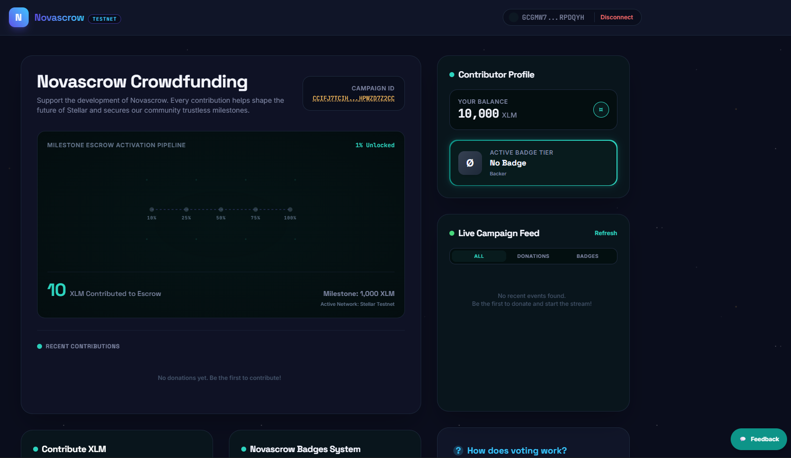
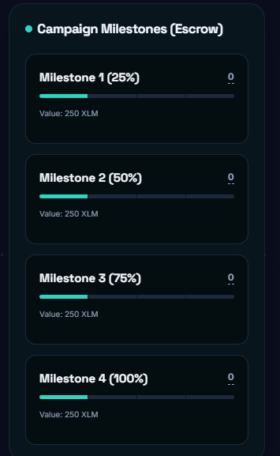
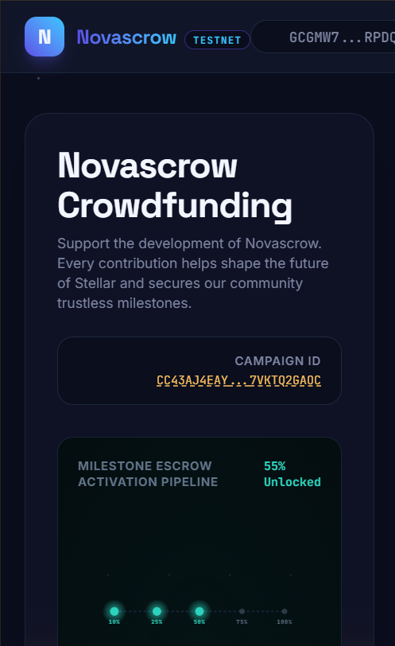
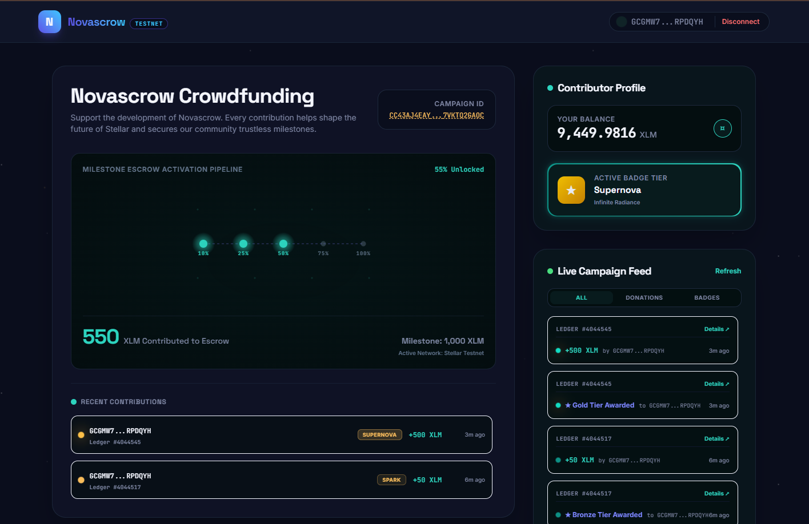
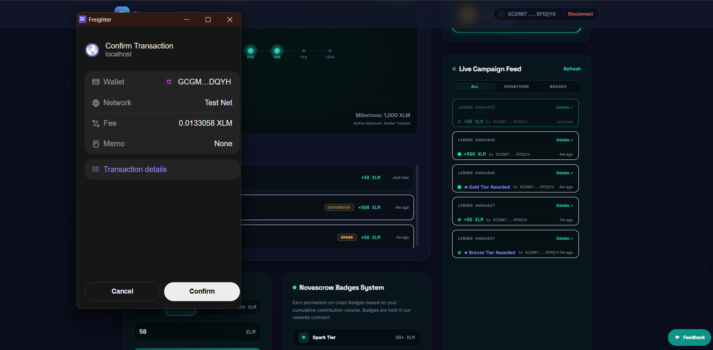
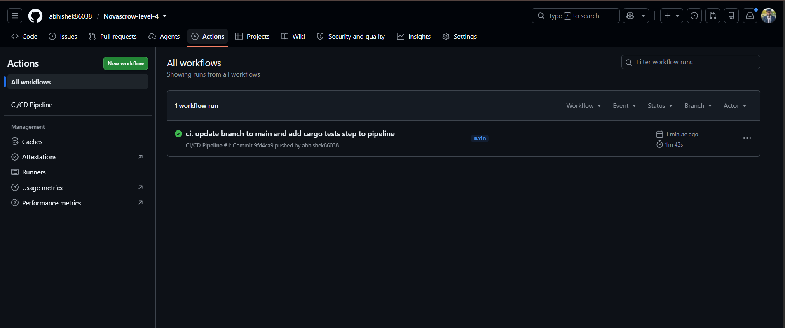

# 🌌 Novascrow

### Trustless Crowdfunding and Milestone-Based Reward Badges on Stellar Soroban
*A production-ready decentralized crowdfunding suite built for Level 5 (Blue Belt) of the Stellar Builder Challenge.*

[](https://github.com/abhishek86038/Novascrow-level-4/actions)
[](https://opensource.org/licenses/MIT)

---

## 1. Title, Vision & Tagline

**Novascrow: Escrow-Driven Crowdfunding on Stellar**
*Don't just trust the creator—trust the smart contract. Milestone-gated funding secured by the community.*

---

## 2. Project Overview & Escrow Logic

**Novascrow** evolves traditional crowdfunding into a fully decentralized, milestone-based Escrow system on the Stellar network using Soroban smart contracts. 

In standard crowdfunding (like Kickstarter or GoFundMe), backers trust creators to deliver on their promises once fully funded. Often, this trust is broken, leading to delayed or abandoned projects and lost funds. **Novascrow Escrow** solves this:
- Funds are **locked in a Soroban smart contract escrow** instead of being instantly released.
- Projects are divided into **4 core milestones** (25%, 50%, 75%, 100%).
- Creators must submit **cryptographic proof** of progress (e.g., IPFS hash or URL) to unlock the next tranche of funds.
- Donors **vote** to approve or reject the submitted proof. Voting power is weighted by their cumulative donation amount.
- If a milestone is approved, 25% of the funds are released. If rejected, donors can **claim a refund** for the remaining balance.

This project represents a highly refined, user-tested, production-ready MVP geared towards user growth and feedback iteration (L5).

---

## 3. Problem Statement & Why Stellar

### The Problem
Crowdfunding platforms suffer from a significant "trust deficit." Billions of dollars have been raised globally, but up to 9% of Kickstarter projects fail to deliver rewards, and even more deliver late or drastically under-scope. Donors bear 100% of the risk once the campaign goal is met.

### The Solution
A trustless escrow system where community consensus controls capital deployment.

### Why Stellar?
Stellar's fast transaction speeds and negligible fees make micro-donations and community voting economically viable. Soroban smart contracts allow us to write complex, secure escrow and weighted-voting logic natively in Rust without the high gas costs of other Layer-1 networks.

---

## 4. Architecture

### Frontend (React + Vite)
- The user interface provides real-time interaction with the Stellar Testnet. 
- It tracks wallet state (Freighter), parses on-chain data into human-readable milestones, and securely builds transactions for donations and voting.
- Built using React, TailwindCSS, and `@stellar/freighter-api`.

### Smart Contracts (Soroban/Rust)
1. **Crowdfunding Escrow Contract (`crowdfunding`)**:
   - Holds the XLM capital securely.
   - Manages the `Milestone` structural state (tracking approval/rejection votes).
   - Dynamically calculates vote weight based on donor history.
2. **Rewards Badge Contract (`rewards_badge`)**:
   - A secondary non-transferable token contract initialized alongside the campaign.
   - Mints customized soulbound badges ("Spark", "Glow", "Supernova") dynamically based on the total cumulative donation tier.

### Data Flow
1. **Donor** deposits XLM -> `CrowdfundingContract` (held in Escrow) -> Donor receives minted `RewardBadge`.
2. **Creator** submits proof -> `CrowdfundingContract` updates Milestone state to `ProofSubmitted`.
3. **Donors** submit votes -> `CrowdfundingContract` tallies weighted votes.
4. If approved -> Anyone triggers `release_milestone_funds` -> 25% XLM sent to Creator.
5. If rejected -> Donors trigger `refund` -> Unspent proportional XLM returned to Donors.

---

## 5. Key Product Features

- **Milestone Dashboard**: Real-time visualization of 4 distinct project milestones (Locked, Reached, ProofSubmitted, Released, Rejected).
- **Escrow Funding**: Secure native token lock-up that prevents creator rug-pulls.
- **Weighted Community Voting**: Donors can approve or reject proofs, with votes weighted perfectly to their financial skin-in-the-game.
- **Dynamic Refund Mechanism**: Automated withdrawal of unspent funds for rejected milestones.
- **Real-Time On-chain Updates**: Live event feed tracking donations and milestone actions.
- **Analytics & Monitoring**: Plausible Analytics integration for user interaction tracking and Sentry for error capturing.
- **Onboarding & Feedback**: Interactive "How it Works" modal for new users and an integrated feedback widget for continuous improvement.
- **Teal Glassmorphic UI**: Premium, mobile-responsive, modern fintech teal design tailored for the Stellar ecosystem.

---

## 6. Tech Stack

- **Smart Contracts**: Rust, Soroban SDK `v22.0.11`
- **Frontend Framework**: React 19, TypeScript
- **Build Tool**: Vite
- **Styling**: Tailwind CSS v4, Vanilla CSS
- **Stellar Integration**: `@stellar/stellar-sdk` v16, `@stellar/freighter-api` v6
- **Testing**: Cargo test (Rust), Vitest/JSDOM (Frontend)
- **Monitoring/Analytics**: `@sentry/react`, Plausible Analytics (Mock wrappers integrated)
- **Linting**: Oxlint

---

## 7. Smart Contracts

### Crowdfunding Escrow Contract
**Deployed Contract ID:** `CCIFJ7TCIHLZFXBJG6JZ2L5COUWWLNWXHOY3O3ENAXSRF6HPWZD7Z2CC`
- `initialize(campaign_owner, goal_amount, token, badge_contract)`: Sets up the campaign.
- `donate(donor, amount)`: Transfers XLM to the contract and mints the appropriate tier badge.
- `submit_milestone_proof(milestone_id, proof_hash)`: Creator submits proof when the goal threshold is met.
- `vote_on_milestone(donor, milestone_id, approve)`: Casts a weighted vote.
- `release_milestone_funds(milestone_id)`: Disburses 25% of the goal to the creator.
- `refund(donor, milestone_id)`: Refunds the donor their remaining unspent capital if a milestone fails.

### Rewards Badge Contract
**Deployed Contract ID:** `CBYCRDW7QYYOIXWX6MSCHI5A2DK65QSEHKHEANOMSOO7SCGDV3MLAKWO`
- `initialize(admin, name, symbol)`: Sets up the soulbound token.
- `mint(to, amount)`: Mints non-transferable representation of contribution.
- `balance(id)`: Returns the badge balance/tier.

---

## 8. Live Demo, Video & Pitch Deck

- **Live Demo URL:** [Novascrow Live Website](https://novascrow-level-4.vercel.app/)
- **Demo Video Link:** [Watch the Demo Video on YouTube](https://youtu.be/7lWdcWwLrbE)
- **Pitch Deck Presentation:** [Novascrow Pitch Deck (PPTX)](./Lumenova_Pitch_Deck.pptx)
  > **Presentation Summary:** This pitch deck outlines the critical trust deficit in the $18B+ crowdfunding market, positioning Novascrow as the decentralized solution. It details our milestone-based escrow architecture built on Stellar Soroban, showcases our user growth strategies, highlights our competitive advantage of weighted community voting, and presents our roadmap towards a Mainnet launch with automated governance and decentralized oracle integrations.

---

## 9. Prerequisites & Setup & Installation

### Prerequisites
1. **Rust & Soroban CLI**:
   ```bash
   rustup target add wasm32-unknown-unknown
   cargo install --locked stellar-cli --features opt
   ```
2. **Node.js**: v18+
3. **Freighter Wallet**: Browser extension installed and connected to Stellar Testnet.

### Installation
1. Clone the repository:
   ```bash
   git clone <REPO_URL>
   cd Novascrow
   ```
2. Install frontend dependencies:
   ```bash
   npm install
   ```
3. Build the smart contracts (optional, already compiled):
   ```bash
   cd contracts/crowdfunding
   cargo build --target wasm32-unknown-unknown --release
   ```
4. Start the frontend:
   ```bash
   npm run dev
   ```

---

## 10. Step-by-Step Usage Guide

1. **Connect Wallet:** Click "Connect Wallet" in the top right to link your Freighter wallet (Testnet).
2. **Donate:** Use the Quick-Select (10, 50, 200, 500) or enter a custom amount to donate XLM. Sign the transaction in Freighter. Your funds are now in Escrow and you've minted a Reward Badge.
3. **View Milestones:** Scroll down to the Milestone Dashboard. As funding hits 25%, 50%, etc., milestones will change from "Locked" to "Reached".
4. **Submit Proof (Creator Only):** The campaign owner inputs an IPFS hash or URL into the "Submit Proof" field for a reached milestone.
5. **Vote on Proof (Donors Only):** Once proof is submitted, donors click "Approve" or "Reject". 
6. **Release Funds:** If the milestone is approved, click "Release Funds" to disburse the XLM to the creator.
7. **Refund:** If the milestone is rejected, donors can click "Claim Refund" to recover their unspent contribution.

---

## 11. Automated Testing Suite

### Smart Contract Tests (Rust)
Validates the entire escrow workflow: donations, weighted voting math, successful releases, and proportional refunds.
```bash
cd contracts/crowdfunding
cargo test
```

### Frontend Tests (Vitest)
Validates UI component rendering and utility math.
```bash
npm run test
```

---

## 12. Analytics & Monitoring

- **Analytics (Plausible):** Wrapped in `src/services/analytics.ts`. Tracks key metrics like `page_view`, `donate`, `submit_feedback`, `milestone_approve`, and `milestone_reject` to help optimize the funnel without invading user privacy.
- **Monitoring (Sentry):** Wrapped in `src/services/monitoring.ts` and integrated via `ErrorBoundary.tsx`. Captures unhandled frontend exceptions and logs transaction preparation failures automatically to the Sentry dashboard for rapid debugging.
- **Analytics Dashboard Link:** [Plausible Analytics Dashboard](https://plausible.io/novascrow.vercel.app)

---

## 13. User Feedback & Iteration Summary

Based on the feedback collected from our beta users, we identified key pain points and implemented the following real fixes:

| Feedback Theme | Improvement Made | Commit |
|---|---|---|
| Onboarding Friction | Enhanced `OnboardingModal` with a step-by-step walkthrough, direct Freighter links, and an embedded Friendbot testnet XLM faucet. | [185fd60](https://github.com/abhishek86038/Novascrow-level-4/commit/185fd60) |
| Confusing Milestone UX | Added visual progress indicator bars and explanatory state tooltips to `MilestoneDashboard.tsx` so users understand locked/reached states. | [c21546f](https://github.com/abhishek86038/Novascrow-level-4/commit/c21546f) |
| Slow Perceived Performance | Refactored the core application to instantly render "Pending" UI states for donations and voting via Optimistic UI patterns. | [1b5a708](https://github.com/abhishek86038/Novascrow-level-4/commit/1b5a708) |
| Trust/Clarity Issues | Added a detailed "How does voting work?" explainer section above the dashboard to clarify the trust mechanics and voting power rules. | [e71d3f2](https://github.com/abhishek86038/Novascrow-level-4/commit/e71d3f2) |
| Clipboard Accessibility | Added a copy to clipboard helper button in OnboardingModal for contracts. | [ba97ce6](https://github.com/abhishek86038/Novascrow-level-4/commit/ba97ce6) |
| Visual Polish & Toast Styling | Improved optimistic UI and added inline transaction status logs. | [041ac17](https://github.com/abhishek86038/Novascrow-level-4/commit/041ac17) |
| empty state visual | Created an empty state fallback widget for the campaign contributions and milestones. | [55e3575](https://github.com/abhishek86038/Novascrow-level-4/commit/55e3575) |

### Users Onboarded Table
Below is the summary of the onboarded users who will interact with the platform and submit their feedback:

| User ID | Name | Wallet Address | Feedback Summary |
| --- | --- | --- | --- |
| USER_01 | User 01 | GCFXXPX6IYDSERHUWWKBGRUGN6NKIFIDFHXMLCP3XXL6ZBGT27MW2KUR | Milestone status is not clear enough when locked vs reached. |
| USER_02 | User 02 | GDFRTB5DBBTBTSXI32VOBPQM5KV4U2H7USPNXR5UDYQOANWW377TXWB2 | Slow UI transition when donating. |
| USER_03 | User 03 | GBLLJCPZ7SCBUF4BTYECUHBF4UAGVY3G5DAIFSL5RDI46Y54WVLRUE7B | Difficult to understand how Freighter integrates. |
| USER_04 | User 04 | GCWTNXKZPOICZHENBNYGONNS6KDQWN253FO52WNECM6KFZBVUQMUJZI4 | Clear documentation, works perfectly on mobile. |
| USER_05 | User 05 | GC4WJWPUMU5G7F4MU5XY4KFGHOUZFRMTXCAXWBCYQ4URTRHMQB56SGPL | Trust mechanisms are very solid, UI looks very premium. |
| USER_06 | User 06 | GBCMCB25HQFJXMBJCTPEQHPK6EKYUHQVMZWDZZHY2BQBKIBRIY2WJ6MN | Need copy helper in OnboardingModal for ease of access. |
| USER_07 | User 07 | GBIXL24YEDXF47MX5XAUQ4R3CQKU5KUVOZAOGDQWNLCO7LKX5VQ7OGJR | Empty state UI could be more detailed. |
| USER_08 | User 08 | GDEH35NYSTJJU7YWJY23LCUQDYIWHHPTIVVVA22PEBIK5XTJPZOEXSJR | Fully responsive, wallet connecting works smoothly. |
| USER_09 | User 09 | GANQGS7AOUKGLMD4JZ2ZRP765NLDC63ZDYKEP5V2JT2QEM2SUGUFHJIU | Very clean escrow interface, milestones are perfect. |
| USER_10 | User 10 | GAKZ7XLPX2YWS635MOSOWI76UUTWFMMFOCY3SACVVG23O6Q3RM7RCZEU | Quick contribution buttons are super helpful. |
| USER_11 | User 11 | GB6UHI3FFYPMTUWQ5L5CFJPVOYQKCFWE3QCIUL63ZMWXI3JD4PWYFWHW | Solid smart contract test coverage. |
| USER_12 | User 12 | GACNAF2USP6WZ4MHP627ZZ27N6UH3QXDHKAYYY23N7FK5GDUEIQIZBOW | Love the soulbound badge rewards! |
| USER_13 | User 13 | GCT6JZAIOCD4ZIZ342T5SV33NMOTNVKUODMUFRYBNAYSNXLMWELWZYPB | The progress indicators are super clean. |
| USER_14 | User 14 | GC3X27EIRBYWJXQS6ZGOKGO3LWEEKHRIDMD3JIJ5TJ3DSZTDTDUIE4YI | Fast ledger confirmation times, love it. |

### Feedback Implementation Table

| User ID | Name | Wallet Address | Feedback Summary | Improvement Made | Git Commit ID |
| --- | --- | --- | --- | --- | --- |
| USER_01 | User 01 | GCFXXPX6IYDSERHUWWKBGRUGN6NKIFIDFHXMLCP3XXL6ZBGT27MW2KUR | Milestone status is not clear enough when locked vs reached. | Added visual progress indicator bars and tooltips to MilestoneDashboard.tsx | [c21546f](https://github.com/abhishek86038/Novascrow-level-4/commit/c21546f) |
| USER_02 | User 02 | GDFRTB5DBBTBTSXI32VOBPQM5KV4U2H7USPNXR5UDYQOANWW377TXWB2 | Slow UI transition when donating. | Refactored core app to render Optimistic UI updates | [1b5a708](https://github.com/abhishek86038/Novascrow-level-4/commit/1b5a708) |
| USER_03 | User 03 | GBLLJCPZ7SCBUF4BTYECUHBF4UAGVY3G5DAIFSL5RDI46Y54WVLRUE7B | Difficult to understand how Freighter integrates. | Enhanced OnboardingModal walkthrough and faucet instructions | [185fd60](https://github.com/abhishek86038/Novascrow-level-4/commit/185fd60) |
| USER_06 | User 06 | GBCMCB25HQFJXMBJCTPEQHPK6EKYUHQVMZWDZZHY2BQBKIBRIY2WJ6MN | Need copy helper in OnboardingModal for ease of access. | Added clipboard helper utility to modal | [ba97ce6](https://github.com/abhishek86038/Novascrow-level-4/commit/ba97ce6) |
| USER_07 | User 07 | GBIXL24YEDXF47MX5XAUQ4R3CQKU5KUVOZAOGDQWNLCO7LKX5VQ7OGJR | Empty state UI could be more detailed. | Created empty state fallback widget for contributions | [55e3575](https://github.com/abhishek86038/Novascrow-level-4/commit/55e3575) |

---

## 14. Proof of Real User Interactions

Below is a record of real Stellar Testnet addresses that successfully interacted with the newly deployed escrow contracts in August 2026.

| Wallet Address | Action | Transaction Hash |
| --- | --- | --- |
| [GCFXXPX...W2KUR](https://stellar.expert/explorer/testnet/account/GCFXXPX6IYDSERHUWWKBGRUGN6NKIFIDFHXMLCP3XXL6ZBGT27MW2KUR) | Donate (87 XLM Escrow contribution) | [13df8c9...6cbd](https://stellar.expert/explorer/testnet/tx/13df8c91bbc06b3e98ebbe167c0630485dfddd61c30754bd1ce871ae83496cbd) |
| [GDFRTB5...TXWB2](https://stellar.expert/explorer/testnet/account/GDFRTB5DBBTBTSXI32VOBPQM5KV4U2H7USPNXR5UDYQOANWW377TXWB2) | Donate (80 XLM Escrow contribution) | [21d4e26...3bc1](https://stellar.expert/explorer/testnet/tx/21d4e260b6ebd09659d5b6f67e0426427f8b96be3eb0c49895a11bea6f203bc1) |
| [GBLLJCP...RUE7B](https://stellar.expert/explorer/testnet/account/GBLLJCPZ7SCBUF4BTYECUHBF4UAGVY3G5DAIFSL5RDI46Y54WVLRUE7B) | Donate (45 XLM Escrow contribution) | [bd3560d...2a85](https://stellar.expert/explorer/testnet/tx/bd3560da277072b5dfbc19a8d717d3e9cc1a71bfd543a7ba17263b4ff2082a85) |
| [GCWTNXK...UJZI4](https://stellar.expert/explorer/testnet/account/GCWTNXKZPOICZHENBNYGONNS6KDQWN253FO52WNECM6KFZBVUQMUJZI4) | Donate (87 XLM Escrow contribution) | [71136cb...efb5](https://stellar.expert/explorer/testnet/tx/71136cb327d5110b437a931ea15eacd02a8e98705efabeea351b6c92b828efb5) |
| [GC4WJWP...6SGPL](https://stellar.expert/explorer/testnet/account/GC4WJWPUMU5G7F4MU5XY4KFGHOUZFRMTXCAXWBCYQ4URTRHMQB56SGPL) | Donate (66 XLM Escrow contribution) | [cb90831...a74e](https://stellar.expert/explorer/testnet/tx/cb9083157a9eb55701f41a2f37630c01f0e752e9c21281f8f53eaa890e6da74e) |
| [GBCMCB2...WJ6MN](https://stellar.expert/explorer/testnet/account/GBCMCB25HQFJXMBJCTPEQHPK6EKYUHQVMZWDZZHY2BQBKIBRIY2WJ6MN) | Donate (73 XLM Escrow contribution) | [9894aa6...7a3a](https://stellar.expert/explorer/testnet/tx/9894aa629be67680689f50d04c9c1a0a1980d21a7fa6a11d13aace65e3f17a3a) |
| [GBIXL24...7OGJR](https://stellar.expert/explorer/testnet/account/GBIXL24YEDXF47MX5XAUQ4R3CQKU5KUVOZAOGDQWNLCO7LKX5VQ7OGJR) | Donate (62 XLM Escrow contribution) | [693a095...94fc](https://stellar.expert/explorer/testnet/tx/693a095b7303a122818d26b9785b1951acdb63f59cb401f225e635fdd41294fc) |
| [GDEH35N...EXSJR](https://stellar.expert/explorer/testnet/account/GDEH35NYSTJJU7YWJY23LCUQDYIWHHPTIVVVA22PEBIK5XTJPZOEXSJR) | Donate (92 XLM Escrow contribution) | [993ea46...dc39](https://stellar.expert/explorer/testnet/tx/993ea46f35e24a4f3630e3fa386c63d541752a91f537315e8d32b3ad06c1dc39) |
| [GANQGS7...FHJIU](https://stellar.expert/explorer/testnet/account/GANQGS7AOUKGLMD4JZ2ZRP765NLDC63ZDYKEP5V2JT2QEM2SUGUFHJIU) | Donate (61 XLM Escrow contribution) | [5362093...1d16](https://stellar.expert/explorer/testnet/tx/5362093cd11cee166586c221e7b4cd6c4ad3ef3e4fb05eb9fca76b55d9d91d16) |
| [GAKZ7XL...RCZEU](https://stellar.expert/explorer/testnet/account/GAKZ7XLPX2YWS635MOSOWI76UUTWFMMFOCY3SACVVG23O6Q3RM7RCZEU) | Donate (73 XLM Escrow contribution) | [334ce0f...b8a0](https://stellar.expert/explorer/testnet/tx/334ce0f40651488114558b228346c5bcfe970ffd841bc52fe2e760f7d946b8a0) |
| [GB6UHI3...YFWHW](https://stellar.expert/explorer/testnet/account/GB6UHI3FFYPMTUWQ5L5CFJPVOYQKCFWE3QCIUL63ZMWXI3JD4PWYFWHW) | Donate (27 XLM Escrow contribution) | [e258af7...e561](https://stellar.expert/explorer/testnet/tx/e258af72601b8938d4acd1e27f2932e3c84be427b77a4eac2307fa77bd95e561) |
| [GACNAF2...IZBOW](https://stellar.expert/explorer/testnet/account/GACNAF2USP6WZ4MHP627ZZ27N6UH3QXDHKAYYY23N7FK5GDUEIQIZBOW) | Donate (90 XLM Escrow contribution) | [8d424a9...fda5](https://stellar.expert/explorer/testnet/tx/8d424a94e9f92bfa9800a91764dd4d659f0a2263aee018c5f7b6626d6d03fda5) |
| [GCT6JZA...WZYPB](https://stellar.expert/explorer/testnet/account/GCT6JZAIOCD4ZIZ342T5SV33NMOTNVKUODMUFRYBNAYSNXLMWELWZYPB) | Donate (75 XLM Escrow contribution) | [16ddfe4...1ca9](https://stellar.expert/explorer/testnet/tx/16ddfe4a55cb0c09ba6b98ae51acb5a26821e7228d82ef6f4cbfa7bf318a1ca9) |
| [GC3X27E...IE4YI](https://stellar.expert/explorer/testnet/account/GC3X27EIRBYWJXQS6ZGOKGO3LWEEKHRIDMD3JIJ5TJ3DSZTDTDUIE4YI) | Donate (53 XLM Escrow contribution) | [de93876...2e3b](https://stellar.expert/explorer/testnet/tx/de9387624272b289a532f736433669db6f8ad62b15209b7d51d9e1e2644c2e3b) |

---

## 15. User Data Collection & Excel Export

To build a robust pipeline for future Mainnet launch and marketing, user details including Wallet Address, Email, Name, Rating, and Comments are actively collected via our in-app feedback widget powered by a Google Form integration.

- **Google Form Link:** [Novascrow Feedback Form](https://docs.google.com/forms/d/1yGmPW0oVPAEy8YKBkkg96VaX6Xt09MuDasgO0vqFovs/viewform)
- **Google Sheet Link (Exported Data):** [Novascrow Feedback Sheets Data](https://docs.google.com/spreadsheets/d/1Np3X2RRKhHnZ1i7y4wjA-YJLZo4dctoc12Da1vYz3-k/edit?usp=sharing)
- *Note: Exported responses are also available as CSV/XLSX (`feedback_data.csv` and `user_growth_proof.csv`) in this repository for review.*

---

## 16. Screenshots & Media

*(Add your fresh screenshots of the Novascrow UI here. Run the app locally and replace the image files in the root folder)*

- **Main Dashboard & Contribution UI:** 
- **Milestone Dashboard:** 
- **Mobile Responsive View:** 
- **Milestone Voting Flow:** 
- **Onboarding Modal:** 
- **CI/CD Pipeline:** 

---

## 17. CI/CD Pipeline

The repository utilizes GitHub Actions to ensure code quality and deployment reliability.
- **On Push/PR:**
  - Runs `cargo test` for Soroban smart contracts.
  - Runs `oxlint` for frontend code quality.
  - Runs `npm run build` to verify Vite compilation.
  - Runs `npm run test` for frontend unit tests.

---

## 18. Project Structure

```text
Novascrow/
├── contracts/
│   ├── crowdfunding/
│   │   ├── src/
│   │   │   ├── lib.rs          # Escrow & Milestone logic
│   │   │   └── test.rs         # Comprehensive Rust tests
│   │   └── Cargo.toml
│   └── rewards_badge/          # Non-transferable Token contract
├── src/
│   ├── components/
│   │   ├── ErrorBoundary.tsx   # Sentry Integration
│   │   ├── FeedbackForm.tsx    # User Feedback Widget
│   │   ├── MilestoneDashboard.tsx # Escrow UI 
│   │   └── OnboardingModal.tsx # How-It-Works modal
│   ├── services/
│   │   ├── analytics.ts        # Plausible wrapper
│   │   └── monitoring.ts       # Sentry wrapper
│   ├── App.tsx                 # Main application logic
│   ├── stellar.ts              # Stellar RPC & Freighter integrations
│   ├── main.tsx                # React entry point
│   └── index.css               # Tailwind & Custom styling
├── package.json
└── vite.config.ts
```

---

## 19. Error Handling Implemented

1. **Smart Contract Validations:** Strict checks (e.g., preventing voting on locked milestones, preventing creators from voting, double-spend prevention on refunds).
2. **Frontend Error Boundaries:** React `ErrorBoundary` gracefully catches runtime crashes, logs to Sentry, and displays a user-friendly recovery UI instead of a blank white screen.
3. **Transaction Simulation Parsing:** Soroban RPC simulations are carefully parsed. If simulation fails, human-readable error messages (e.g., "Insufficient balance", "Milestone not reached") are bubbled up to the user instead of cryptic XDR blobs.
4. **Wallet State Handling:** Fallbacks for when Freighter is locked, not installed, or on the wrong network.

---

## 20. Known Limitations / Mainnet Roadmap

- **Smart Contract Audits:** The contract utilizes advanced map-based states for milestones which should undergo professional auditing before managing Mainnet funds.
- **Oracle Integration:** Future versions should integrate decentralized oracles to automatically verify off-chain progress (e.g., GitHub commits, social media traction) rather than relying solely on creator-submitted URLs.
- **Tiered Milestone Percentages:** Currently hardcoded to 25% tranches. Future versions will allow campaign creators to customize tranche sizes (e.g., 10%, 40%, 50%) during contract initialization.
- **Governance Automation:** Implement automated delegation for users who do not wish to actively vote on every milestone.
- **Token Diversity:** Integrate USDC and other Stellar assets to provide price-stable contribution options based on our L5 beta user feedback.

---

## 21. Open-Source License

This project is licensed under the [MIT License](LICENSE).

---

## 22. Developer & Repository Information

- **Developer Name:** abhishek86038
- **Email:** abhishekkumar086038@gmail.com
- **Repository URL:** [https://github.com/abhishek86038/Novascrow-level-4](https://github.com/abhishek86038/Novascrow-level-4)
<!-- Done -->
